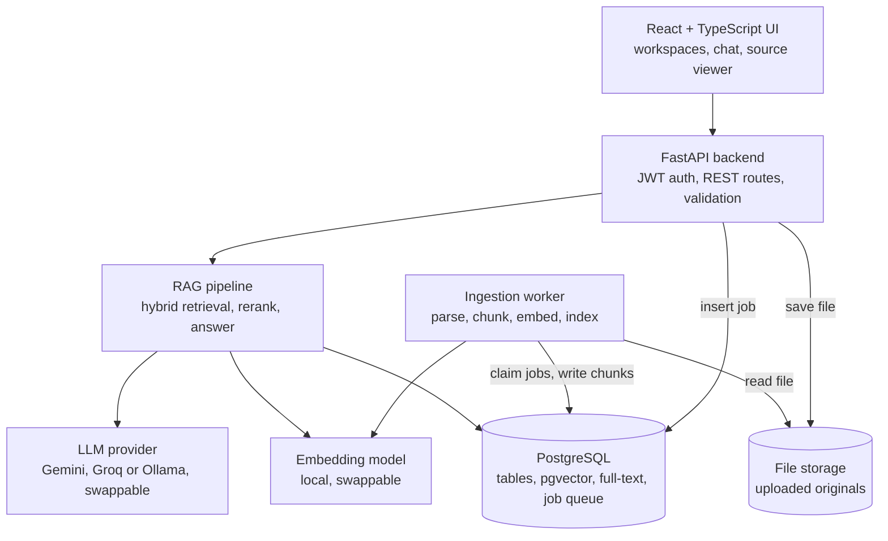
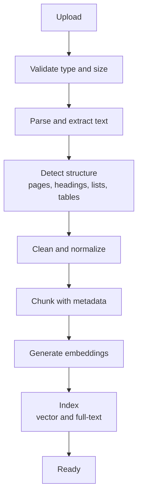
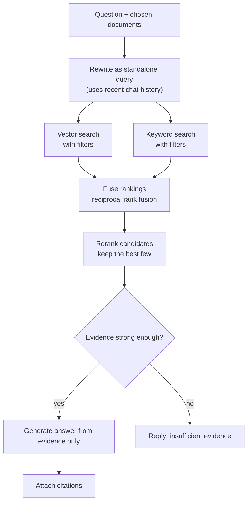
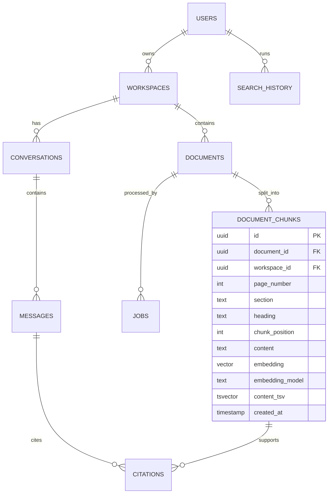

# Architecture

**Status:** Draft v0.1, Milestone 1 (2026-10-01)

Two paths share one database. **Ingestion** turns documents into searchable chunks. The **query pipeline** turns a question into a cited answer. An **evaluation harness** measures the query pipeline.

Diagrams use Mermaid, which GitHub renders automatically.

## 1. System overview

## 2. Ingestion pipeline

Runs in the worker, never in the request that uploaded the file.

The job status moves through `uploaded`, `processing`, `embedding`, `indexing`, and `ready` (or `failed`), and the UI shows it.

## 3. Query pipeline

## 4. Why each component exists

- **React + TypeScript UI:** the product people actually use: workspaces, upload with live status, chat, search, and the source viewer. It is built after the API works, so everything before it is testable through FastAPI's OpenAPI page.
- **FastAPI backend:** the only door into the system. It authenticates every request, validates input, enforces isolation, and exposes the REST routes (`/auth`, `/workspaces`, `/documents`, `/search`, `/chat`, `/conversations`, `/citations`, `/summaries`, `/comparisons`, `/evaluation`, `/admin`).
- **Ingestion worker:** a separate process that does the slow work (parse, chunk, embed, index), so uploads return instantly and a crash never takes the API down. It claims jobs from a Postgres table.
- **RAG pipeline:** code inside the backend that turns a question into a cited answer: filters, hybrid search, rerank, the refusal check, generation, and citations.
- **Embedding model:** turns text into vectors so meaning can be compared. Ingestion uses it for chunks and queries use it for the question, and both must use the same model.
- **LLM provider:** writes the answer from the evidence. It sits behind an interface so Gemini, Groq, or Ollama can be swapped by configuration.
- **PostgreSQL:** one store for users, workspaces, documents, chunks, vectors (pgvector), the keyword index (full-text search), conversations, citations, logs, and the job queue.
- **File storage:** keeps the original uploads so the source viewer can show the exact page. A Docker volume locally.
- **Evaluation harness:** runs a golden question set through the pipeline and scores retrieval, citations, groundedness, relevance, and latency. It is how the FYP report proves the system works.

## 5. First data model sketch

Column-level design happens in Milestone 3. `workspace_id` is stored on chunks as well as documents, so every retrieval query can filter by workspace directly.

## 6. Isolation rule

Every table that holds user data carries an owner or workspace key. The backend takes the user from the JWT, never from the request body, and every query is limited to that user's workspaces. Every retrieval query includes the workspace filter.

## 7. Tech stack

| Layer | Choice | Free | Why |
|---|---|---|---|
| Frontend | React + TypeScript | Yes | Typed UI, large ecosystem, PDF viewer libraries for the source viewer. |
| Backend | Python + FastAPI | Yes | Async, automatic OpenAPI docs, strong ML ecosystem. |
| Database | PostgreSQL | Yes (Docker) | Relational data, full-text search, and vectors in one place. |
| Vector search | pgvector | Yes | Nearest-neighbour search and metadata filters in plain SQL. |
| Keyword search | Postgres full-text search | Yes | Catches names, IDs, and exact terms. Not BM25 (see `decisions.md`, D-03). |
| Embeddings | `nomic-embed-text` via Ollama (default) | Yes | Small and runs on a CPU. Swappable. |
| LLM | Gemini free tier, Groq free tier, or Ollama | Yes (rate-limited) | Switchable by configuration. Limits and terms change, so recheck at Milestone 9. |
| Reranker | Local cross-encoder (sentence-transformers) | Yes | Orders a short candidate list more accurately than vector similarity alone. |
| Jobs | Postgres job table + worker process | Yes | One less service than Celery + Redis. |
| Auth | JWT, hashed passwords | Yes | Stateless API authentication. |
| Packaging | Docker Compose | Yes | One command runs everything. |
| CI | GitHub Actions | Yes | Tests on every push. |
| Hosting | Decided in Milestone 16 | n/a | Free options change often, so check then. |